# CASIO CLASSWIZ CG Graphing Calculator UX/UI Report

## Calculator Models
- **fx-CG100** (Version 2.00)
- **fx-1AU GRAPH** (Version 2.00)

This report documents the graphing flow UX/UI for the CASIO CLASSWIZ CG Graphics Calculator based on the official Software User's Guide.

---

## Overview

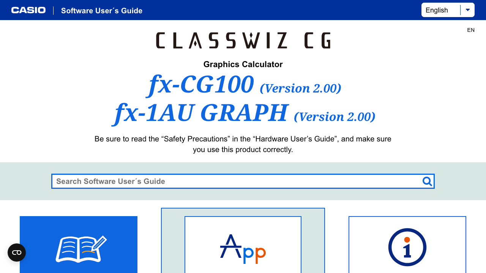

The Graph&Table App is the primary tool for graphing functions. It allows users to:
- Draw various types of graphs
- Create numeric tables
- Analyze graph properties (roots, intersections, etc.)

---

## 1. Operation Flow (Core Graphing Workflow)

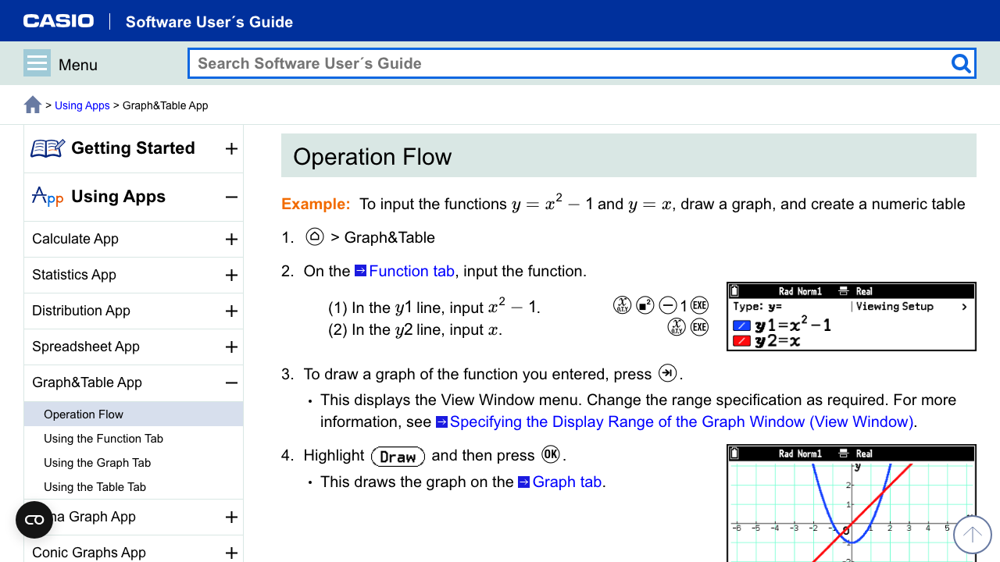

### Step-by-Step Process:

1. **Launch App**: Press Home > Graph&Table
2. **Input Functions**: On the Function tab, enter functions (e.g., y1=x²-1, y2=x)
3. **Draw Graph**: Press the execute key to display View Window menu, configure range
4. **View Graph**: Select "Draw" and press OK to render the graph on the Graph tab
5. **View Table**: Press execute again to display numeric table on the Table tab
6. **Return**: Press execute or back to return to Function tab

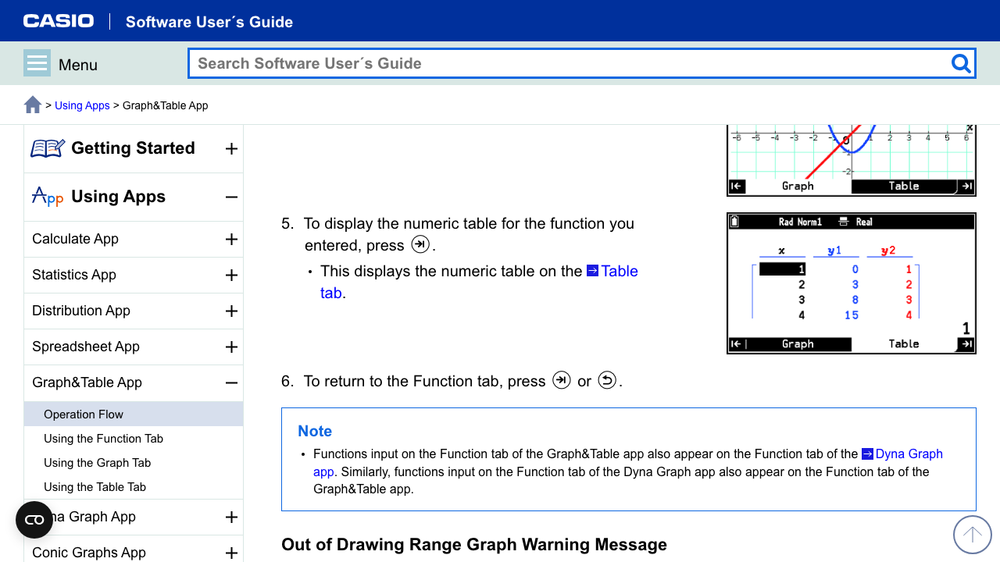

### Key UI Elements:
- **Tab Navigation**: Bottom tabs for Graph/Table switching
- **Status Bar**: Shows mode (Rad/Norm1), display format (Real)
- **Function List**: Shows y1, y2, etc. with checkboxes for enabling/disabling

---

## 2. Function Tab (Input Interface)

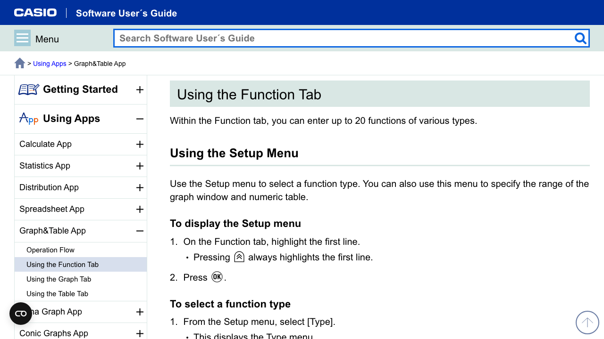

### Setup Menu
- Access by highlighting first line and pressing OK
- Used to select function type and configure graph/table settings

### Function Types Available:

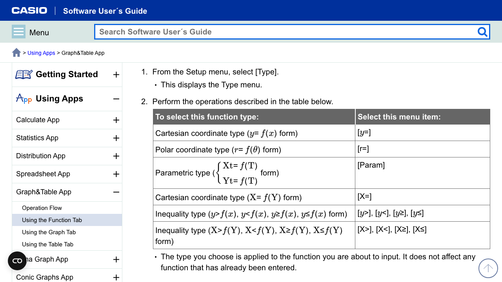

| Function Type | Menu Selection | Format |
|--------------|----------------|--------|
| Cartesian (y=f(x)) | [y=] | y = f(x) |
| Polar | [r=] | r = f(θ) |
| Parametric | [Param] | Xt = f(T), Yt = f(T) |
| Cartesian (X=f(Y)) | [X=] | X = f(Y) |
| Inequality | [y>], [y<], [y≥], [y≤] | y > f(x), etc. |

### Function Input Examples:

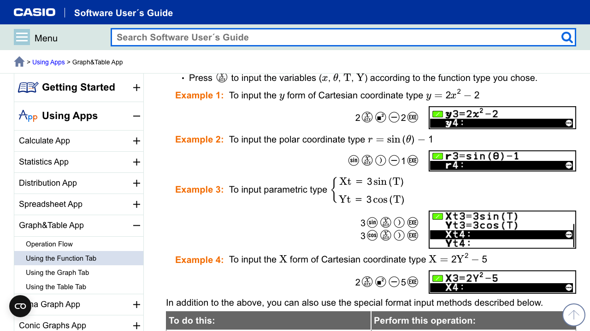

**Example 1 - Cartesian**: y = 2x² - 2
- Key sequence: 2, x², -, 2, EXE

**Example 2 - Polar**: r = sin(θ) - 1
- Key sequence: sin, θ, ), -, 1, EXE

**Example 3 - Parametric**: Xt = 3sin(T), Yt = 3cos(T)
- Enter both Xt and Yt on consecutive lines

**Example 4 - X form**: X = 2Y² - 5

### Advanced Input Features:

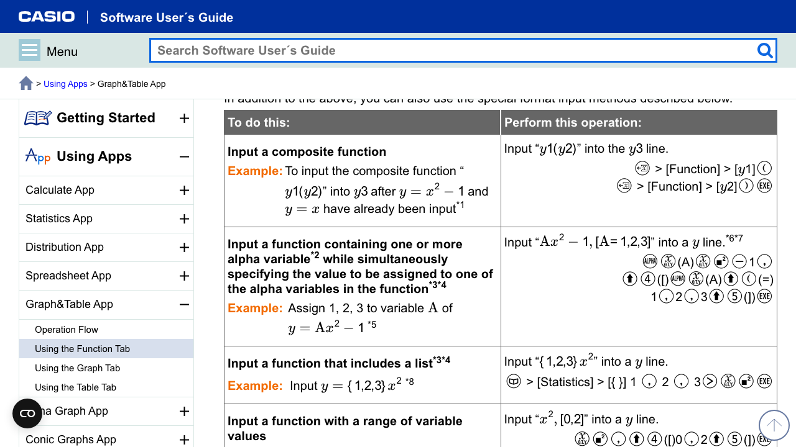

- **Composite Functions**: Input y1(y2) to compose functions
- **Alpha Variables**: Input Ax² - 1 with [A= 1,2,3] for multiple curves
- **List Functions**: Input {1,2,3}x² for family of curves
- **Range Variables**: Input x², [0,2] for domain restriction

---

## 3. Graph Tab (Visualization Interface)

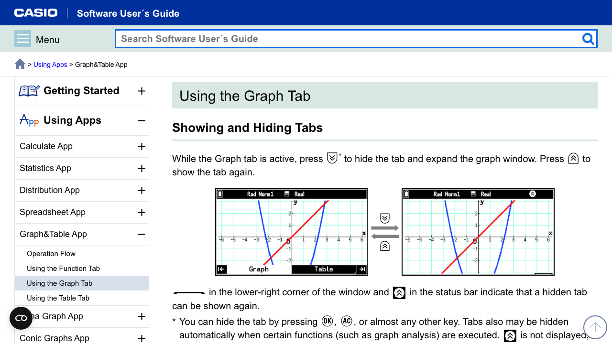

### Tab Show/Hide Feature
- Press specific key to toggle between tabbed view and full-screen graph
- Icon in status bar indicates when tab is hidden
- Allows maximum graph viewing area when needed

### Graph Window Controls:

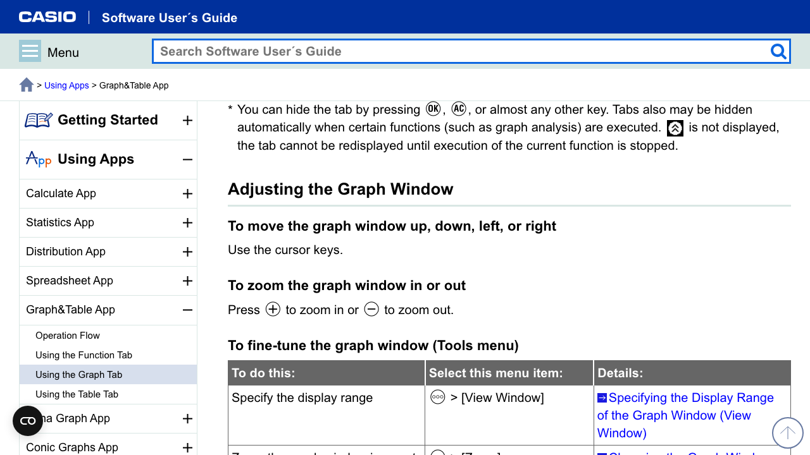

| Action | Method |
|--------|--------|
| Pan/Scroll | Cursor keys (up/down/left/right) |
| Zoom In | Press + key |
| Zoom Out | Press - key |

### Tools Menu:

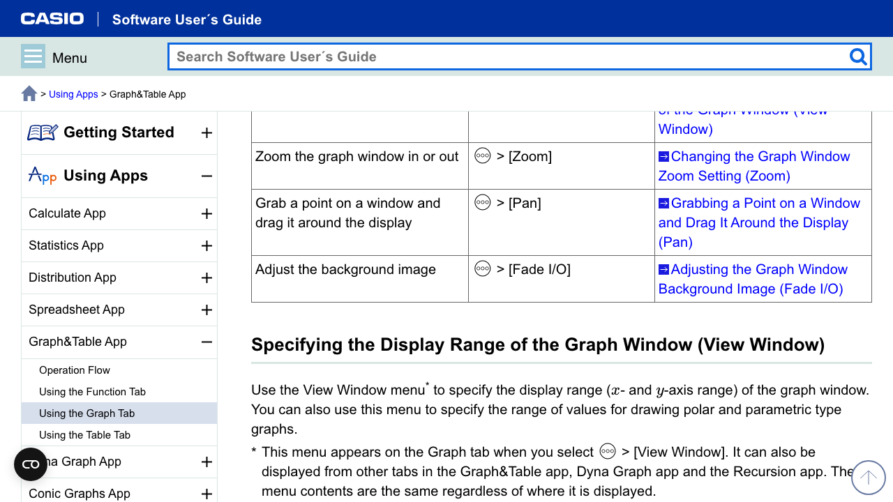

| Tool | Menu Path | Purpose |
|------|-----------|---------|
| View Window | Menu > [View Window] | Set display range (x/y min/max) |
| Zoom | Menu > [Zoom] | Various zoom presets |
| Pan | Menu > [Pan] | Drag-to-move interface |
| Fade I/O | Menu > [Fade I/O] | Adjust background image opacity |

---

## 4. View Window Settings

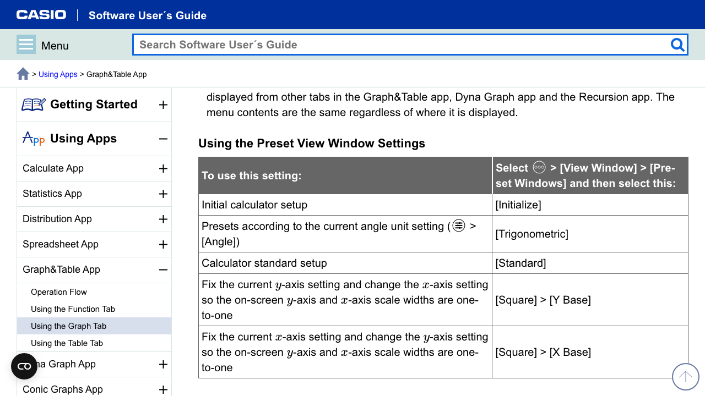

### Preset Window Options:

| Preset | Selection | Description |
|--------|-----------|-------------|
| Initialize | [Initialize] | Reset to factory defaults |
| Trigonometric | [Trigonometric] | Optimized for trig functions |
| Standard | [Standard] | Calculator standard setup |
| Square (Y Base) | [Square] > [Y Base] | 1:1 aspect ratio, Y-axis fixed |
| Square (X Base) | [Square] > [X Base] | 1:1 aspect ratio, X-axis fixed |

### Manual Configuration:
- **x Minimum/Maximum**: Set horizontal range
- **x Scale**: Set x-axis tick spacing
- **y Minimum/Maximum**: Set vertical range
- **y Scale**: Set y-axis tick spacing
- **x Dot Value**: Pixels per unit (auto-calculated)

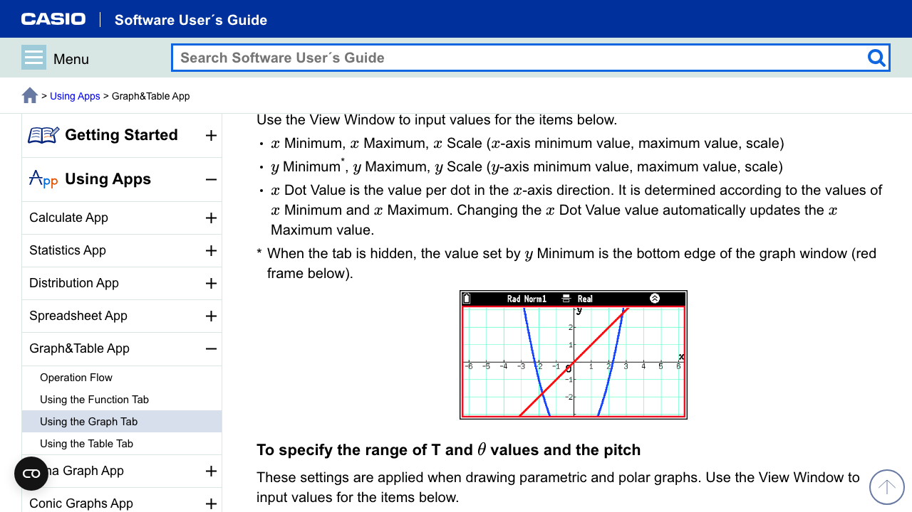

---

## 5. Zoom Features

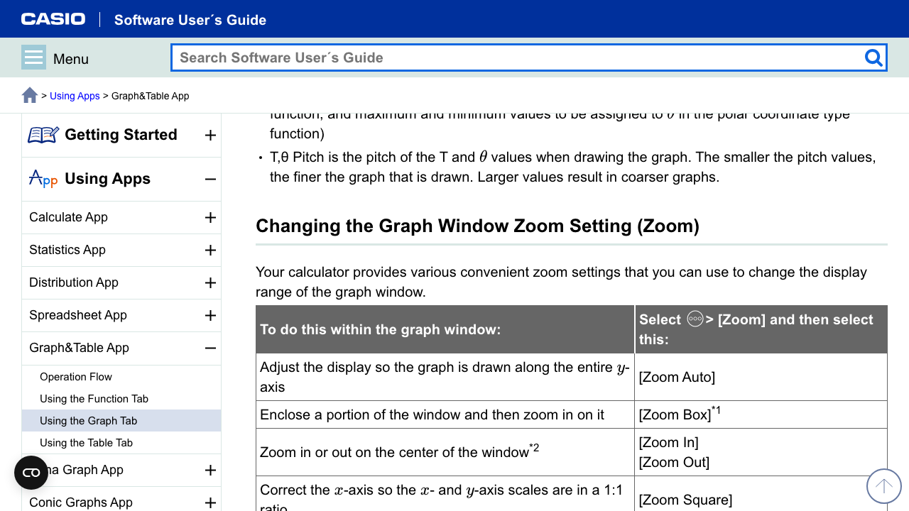

| Zoom Type | Description |
|-----------|-------------|
| Zoom Auto | Auto-fit graph to show full y-range |
| Zoom Box | Draw rectangle to zoom into area |
| Zoom In/Out | Centered zoom by factor |
| Zoom Square | Make axes 1:1 ratio |
| Zoom Integer | Snap x-coordinates to integers |
| Zoom Round | Round coordinates for trace |
| Zoom Original | Restore previous settings |
| Zoom Previous | Undo last zoom |

### Zoom Box Workflow:
1. Select Menu > [Zoom] > [Zoom Box]
2. Cross pointer appears
3. Move to first corner, press OK
4. Move to opposite corner, press OK
5. Graph zooms to selected region

---

## 6. Pan (Drag) Feature

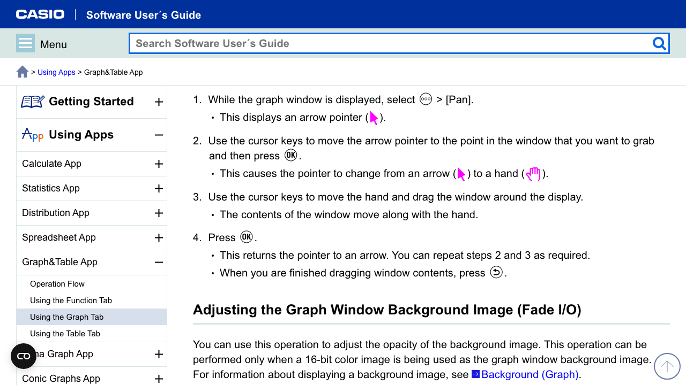

### Pan Workflow:
1. Select Menu > [Pan]
2. Arrow pointer (↖) appears
3. Move to grab point, press OK
4. Pointer changes to hand (✋)
5. Use cursor keys to drag view
6. Press OK to release, Back to exit

---

## 7. Graph Solve (Analysis Tools)

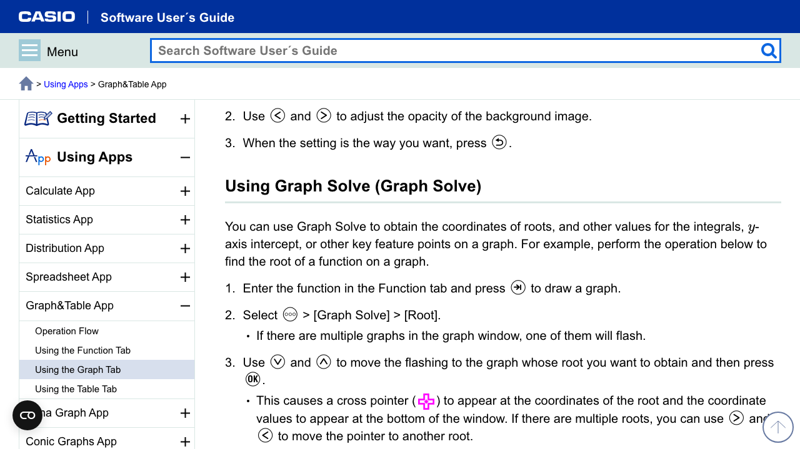

### Available Analysis:
- **Root**: Find x-intercepts (zeros)
- **Maximum/Minimum**: Find local extrema
- **Y-Intercept**: Find y value at x=0
- **Intersection**: Find where graphs cross
- **Integration**: Calculate area under curve

### Root Finding Workflow:
1. Enter function and draw graph
2. Select Menu > [Graph Solve] > [Root]
3. If multiple graphs, select which one (it flashes)
4. Cross pointer appears at root
5. Coordinates shown at bottom
6. Use left/right to move between multiple roots

---

## 8. Table Tab (Numeric Data)

### Table Operations:

| Action | Menu Path |
|--------|-----------|
| Set Table Domain | Menu > [Set Table Domain] |
| Graph Points | Menu > [Graph Points] |
| Graph Points (Joined) | Menu > [Graph Points (Joined)] |
| View Window | Menu > [View Window] |
| Insert/Add Row | Menu > [Row] |
| Edit Data | Menu > [Edit] |
| Store to List | Menu > [Store List] |
| Delete Row/Table | Menu > [Delete] |

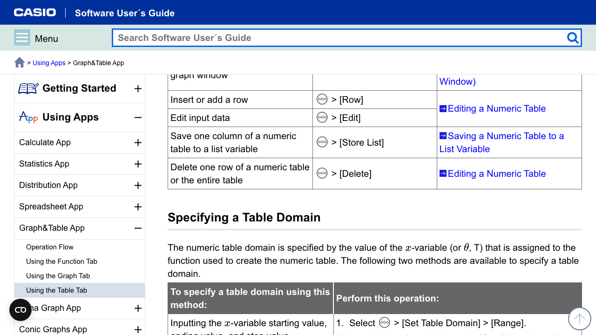

### Table Domain Methods:

1. **Range Method**: Specify start, end, and step values
   - Example: x from -5 to 5, step 0.5
   
2. **List Method**: Use a list variable for x values
   - Example: Use List1 containing specific x values

### Graph-Link Feature:
- While viewing table, pointer on graph shows current row's position
- Navigate table rows to move graph pointer
- Useful for understanding function behavior at specific points

---

## 9. UX Design Patterns Summary

### Navigation Model
- **Tab-based**: Function / Graph / Table tabs at bottom
- **Modal menus**: Press Menu key for context-sensitive options
- **Hierarchical**: Menu > Submenu > Action pattern

### Input Paradigm
- **Line-based**: Each function on its own numbered line (y1, y2, etc.)
- **Checkbox selection**: Enable/disable individual functions
- **Type prefix**: Function type shown before expression

### Visual Feedback
- **Status bar**: Always shows current mode/settings
- **Flashing selection**: When choosing between multiple graphs
- **Cross pointer**: For precise coordinate selection
- **Color coding**: Different colors for different functions (red, blue, etc.)

### Interaction Patterns
- **Cursor key navigation**: Universal for moving/selecting
- **OK to confirm**: Standard confirmation pattern
- **Back to cancel/return**: Consistent escape mechanism
- **Execute key**: Advances to next logical step in workflow

---

## 10. Key UX Strengths

1. **Progressive Disclosure**: Simple flow (input → graph → table) with advanced features in menus
2. **Consistent Tab Pattern**: Always know where you are (Function/Graph/Table)
3. **Visual Continuity**: Same function colors across graph and table
4. **Non-destructive Zoom**: Can always return to previous/original view
5. **Multi-function Support**: Up to 20 functions with individual enable/disable

---

## Screenshots Reference

| File | Description |
|------|-------------|
| 01-main-menu.png | Calculator main menu |
| 02-graph-table-overview.png | Graph&Table app intro |
| 03-operation-flow.png | Basic workflow steps |
| 04-operation-flow-2.png | Workflow with table view |
| 05-function-tab.png | Function input screen |
| 06-function-tab-2.png | Function type selection |
| 07-function-tab-3.png | Display range settings |
| 08-function-input.png | Function input examples |
| 09-function-selection.png | Advanced input methods |
| 10-graph-tab.png | Graph display with tabs |
| 11-graph-window.png | Graph window controls |
| 12-graph-tools.png | Tools menu options |
| 13-view-window.png | View window presets |
| 14-zoom-menu.png | Graph with axis labels |
| 15-trace-feature.png | Zoom options table |
| 16-trace-ui.png | Zoom box instructions |
| 17-pan-trace.png | Pan feature workflow |
| 18-trace-detail.png | Graph Solve feature |
| 19-table-tab.png | Table tab operations |
| 20-table-tab-2.png | Table domain settings |

---

*Report generated from CASIO Software User's Guide*
*Source: https://support.casio.com/global/en/calc/manual/fx-CG100_1AUGRAPH_en/*
